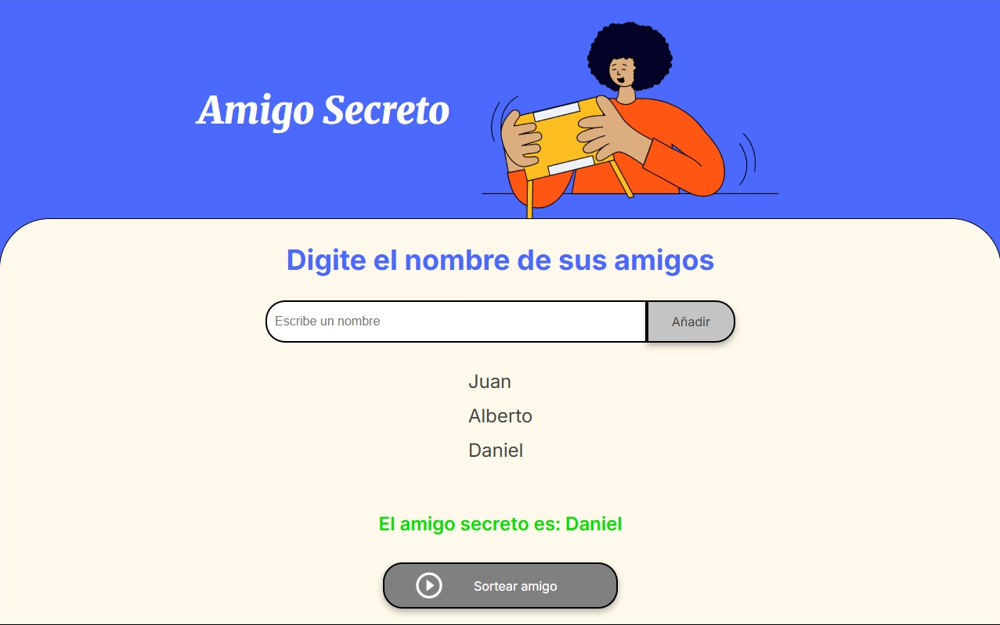

# 🎁 Amigo Secreto - Challenge Alura Latam & Oracle Next Education

Este proyecto es una versión digital del clásico "Amigo Secreto", construido con JavaScript, HTML y CSS. Permite a los usuarios ingresar nombres de amigos en una lista y realizar un sorteo aleatorio para determinar quién será el amigo secreto.

## 🚀 Funcionalidades principales

- 📝 Agregar nombres de amigos a una lista dinámica
- ⚠️ Validación para evitar campos vacíos
- 📋 Visualización de los amigos agregados en pantalla
- 🎲 Sorteo aleatorio de un amigo secreto
- 🔒 Bloqueo del botón de sorteo después de realizarlo para evitar repeticiones

## 🧠 Lo que aprendí

Este proyecto me permitió reforzar conceptos clave en JavaScript, entre ellos:

- Manipulación del DOM
- Validación de entradas para evitar datos nulos o vacíos
- Uso de arrays para almacenar y gestionar datos dinámicamente
- Implementación de funciones puras y separación de responsabilidades
- Generación de números aleatorios con Math.random() y Math.floor()
- Control de estados mediante atributos (disabled) y estilos dinámicos

## 🛠️ Tecnologías utilizadas

- HTML5
- CSS3 (estilos básicos)
- JavaScript (Vanilla JS, sin frameworks)

## 📸 Captura de pantalla



---

## 🧩 Cómo utilizarlo

1. Clonar este repositorio:

```bash
   git clone https://github.com/JulianBcb07/amigo-secreto.git
```

2. Abrir el archivo `index.html` en el navegador
3. Ingresar nombres en el campo de texto y añadirlos a la lista
4. Presionar el botón "Sortear amigo" para descrubir quien será el amigo secreto 🎉

---

<h4 align="center">
👨‍💻 Autor Julian Bacab – [@JulianBcb07](https://github.com/JulianBcb07)
</h4>
